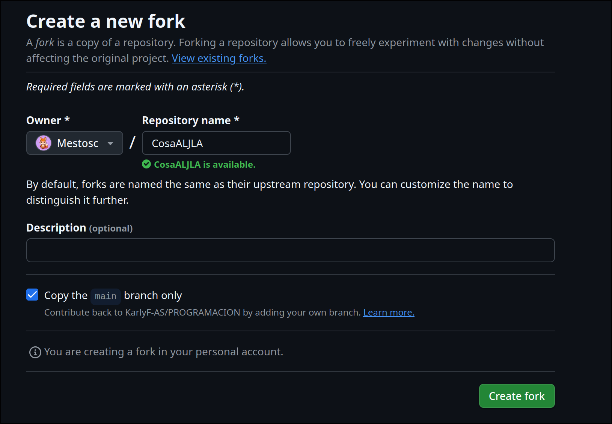
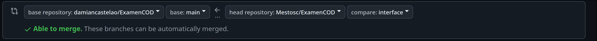

# Proceso Examen COD
## Proceso paso por paso
1. Creacion del fork

    Para crear el fork vamos al repositorio de Github correspondiente en este caso [Este de aqui](https://github.com/damiancastelao/ExamenCOD), una vez hecho eso nos aparecera una ventana donde podemos rellenar info a efectos de lo que hacemos aqui desticaremos el tick que indica copiar solo la rama main
    
    > [!WARNING]
    > ese tick que aparece diciendo `Copy the main branch only` hay que clickarlo y sacarlo para poder hacer el ejercicio

2. Procedere a añadir codigo a la rama interfaz para resolver esta issue que he puesto, no la voy a resolver de verdad que no se hacerlo pero bueno [Issue](https://github.com/Mestosc/ExamenCOD/issues/1), añadire varias cosas para hacer el commit, debido a un asunto que no vi al trabjar con otra rama hice el commit con el close varias veces perdon por eso

3. Ahora que he finalizado la parte de la interfaz he decidido añadir cosas a la rama datos para ir haciendo los commits

4. Ahora hago un Pull Request desde la rama datos hasta mi rama main para lo cual debo ir a la siguiente parte 

## Notas extras
Ahora debo ir a donde pone damian castelao y en el desplegable que se abre elejir mi repositorio y cuando me ponga solamente interface o datos y main se que estoy en mi repositorio, haciendo eso tambien para la rama Interface borre el ultimo commit que hice en local antes de subir y luego ya lo deje subido

Informo que en algun momento me hice el lio por ejemplo mezclando la main en Interface cuando me salio en el pull que habia conflictos no lei bien y no vi que se podia hacer igual pero a parte de eso no hay mucha complicacion.

Aqui estan los dos pull request:

- [Pull Request de Datos](https://github.com/Mestosc/ExamenCOD/pull/2)
- [Pull Request de Interface](https://github.com/Mestosc/ExamenCOD/pull/3)

Aqui proceder a exponer 

